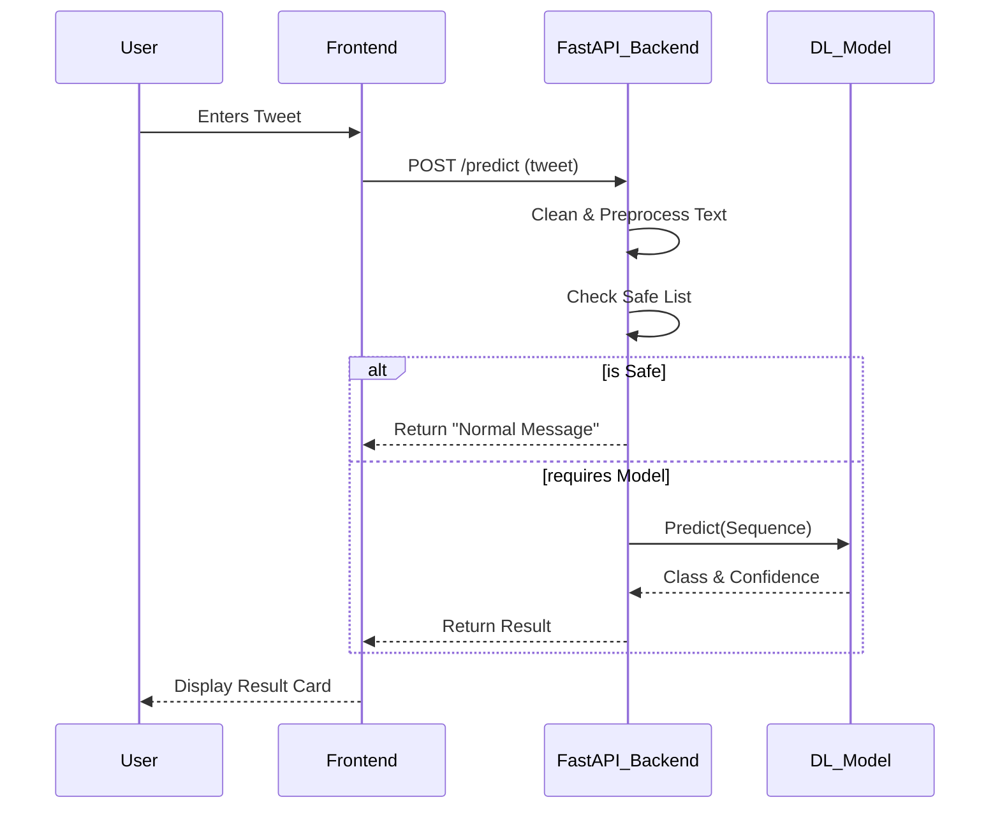

# DEARNING A HYBRID DEEP LEARNING APPROACH FOR CYBERBULLYING DETECTION IN TWITTER SOCIAL MEDIA PLATFORM

## 📌 Project Overview
The rise of social media has fostered connectivity but also gave birth to cyberbullying, a serious issue affecting mental health. This project implements a **Hybrid Deep Learning Model** combining **Convolutional Neural Networks (CNN)** and **Long Short-Term Memory (LSTM)** networks to effectively detect and classify cyberbullying tweets.

The system is deployed as a web application using **FastAPI**, featuring a premium, user-friendly interface.

## 🚀 Features
- **Hybrid Architecture**: Uses CNN for feature extraction and LSTM for sequence learning.
- **Real-time Detection**: Classifies tweets instantly as "Cyberbullying" or "Normal".
- **Multi-Class Classification**: Identifies specific types of bullying (e.g., Ethnicity, Religion, Age, Gender).
- **Safe Word Filtering**: Enhanced logic to correctly identify positive greetings and kind words.
- **Premium UI**: Modern glassmorphism design with interactive elements.

## 🛠️ Technology Stack
- **Frontend**: HTML5, CSS3 (Glassmorphism), JavaScript
- **Backend**: FastAPI (Python)
- **Deep Learning**: TensorFlow/Keras (CNN + LSTM)
- **Data Processing**: Pandas, NumPy, Scikit-learn, NLTK
- **Deployment**: Uvicorn

## 🏗️ System Architecture

The following diagram illustrates the workflow of the proposed system:

```mermaid
graph TD
    A[Input Tweet] --> B[Data Preprocessing]
    B --> C{Tokenizer & Padding}
    C --> D[Embedding Layer]
    D --> E[Spatial Dropout]
    E --> F[Convolutional Layer (CNN)]
    F --> G[MaxPooling Layer]
    G --> H[LSTM Layer]
    H --> I[Dense Layer (Softmax)]
    I --> J[Classification Output]
    
    style A fill:#f9f,stroke:#333
    style J fill:#9f9,stroke:#333
    style F fill:#8da,stroke:#333
    style H fill:#8da,stroke:#333
```

### Implementation Flow



## 🔧 Installation & Setup

1. **Clone the Repository**
   ```bash
   git clone https://github.com/Abdullasaqib/DEARNING-A-HYBRID-DEEP-LEARNING-APPROCH-FOR-CYBERBULLYING-DETECTION-IN-TWITTER-SOCIAL-MEDIA-PLATFORM.git
   cd cyber
   ```

2. **Create Virtual Environment**
   ```bash
   python -m venv venv
   # Windows
   .\venv\Scripts\activate
   # Mac/Linux
   source venv/bin/activate
   ```

3. **Install Dependencies**
   ```bash
   pip install -r requirements.txt
   ```

4. **Train the Model (If needed)**
   ```bash
   python train_model.py
   ```

5. **Run the Application**
   ```bash
   python -m uvicorn app:app --reload
   ```

6. **Access the App**
   Open your browser and navigate to `http://127.0.0.1:8000`

## 📂 Project Structure
```
cyber/
├── static/
│   └── style.css          # Premium Styling
├── templates/
│   └── index.html         # Frontend Interface
├── app.py                 # FastAPI Application
├── train_model.py         # Model Training Script
├── requirements.txt       # Project Dependencies
├── cyberbullying_tweets.csv # Dataset
└── README.md              # Project Documentation
```

## 📊 Model Performance
The hybrid CNN-LSTM model achieves high accuracy by leveraging CNN's ability to extract local features (phrases) and LSTM's ability to capture long-term dependencies (context) in text.

---
*Developed for CSE Final Year Project*
